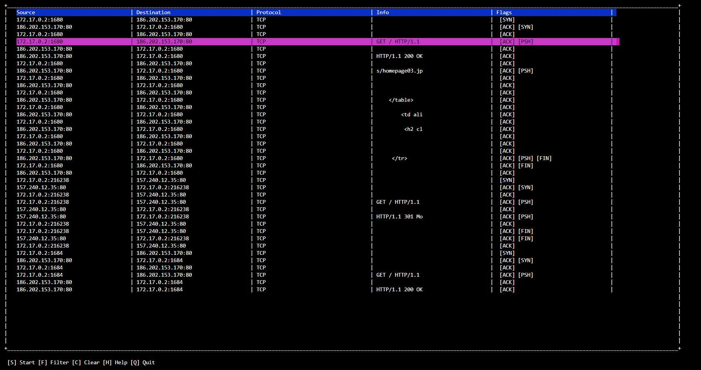
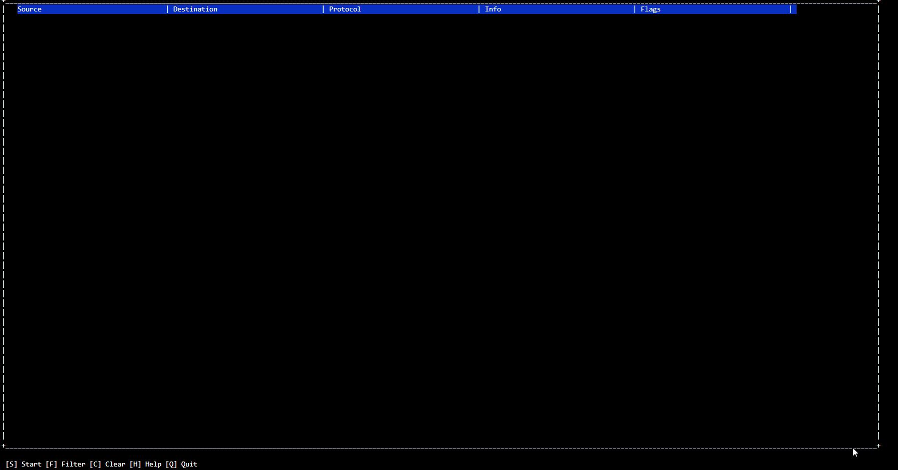

# HOUSE MOUSE

House Mouse is a packet sniffer written in ruby with an awesome <a href="https://en.wikipedia.org/wiki/Text-based_user_interface">tui</a>

## IN ACTION

## TODO
 - Refactor
 - Support to udp packets
 - IPV6
 - Improve filter
 - Fix stop command

 
 

## Credits
### LOGO BY
<a href="https://www.freepik.com/vectors/design">Design vector created by freepik - www.freepik.com</a>